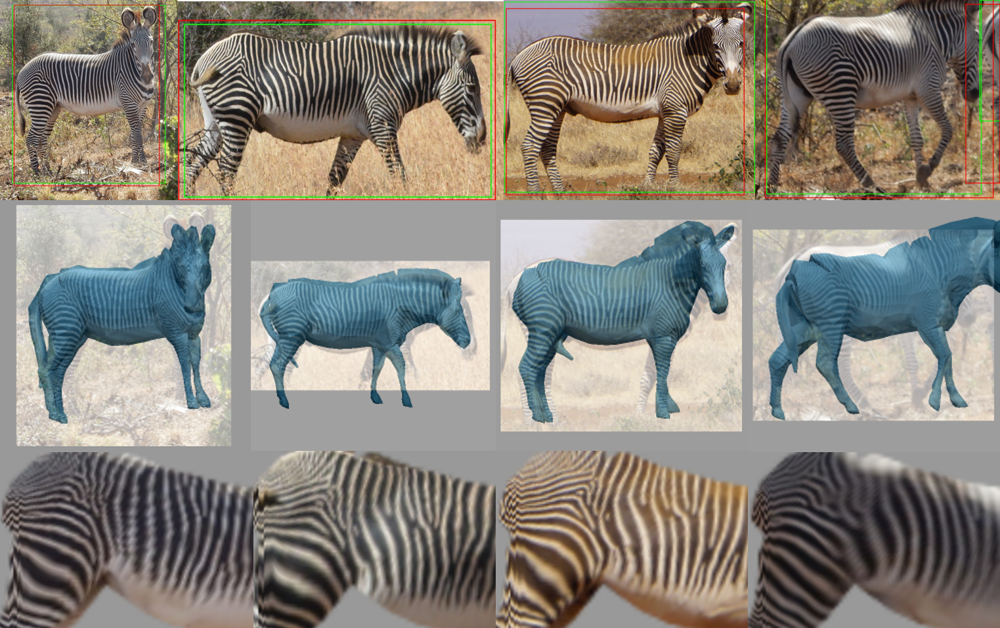
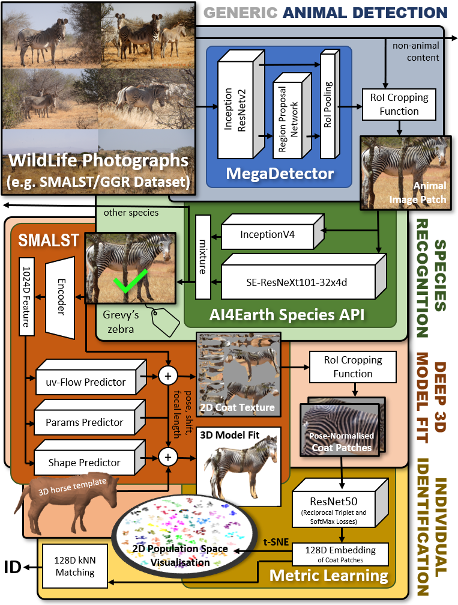

# Individual Identification of Grevy's Zebras
Deep learning technqiues for species detection, 3D model fitting, and metric learning are combined to form a novel pipeline for the individual identification of Grevy's zebras from photographs by utalising their unique coat patterns like a fingerprint. This is the first work to attempt this and, compared to traditional 2D bounding box or segmentation based CNN identification pipelines, the approach provides effective and explicit view-point normalisation and allows for a straight forward visualisation of the learned biometric population space. 

This achieved an indentifcation accuracy of 56.8% on the SMALST dataset. This study is far to small to estimate the full perfromance pontential or for comparisions against polished tools, but acts as a proof-of-concept and possible groundwork for further steps.



Above shows normalised coat pattern extraction. The top row shows test image regions containing zebras with the MegaDetector bounding box output (in
red) and ground truth (in green). The middle row shows SMALST fitted 3D zebra models superimposed on the 2D images. The bottom row depicts the back-projected and fully viewpoint and pose normalised texture maps of the zebra hindquarter and back used to identify the individual. Note that the middle two and left/right columns depict the same individual, respectively.


## Dataset
The data is a combination of the test and validation dataset from [SMALST](https://github.com/silviazuffi/smalst). In total it includes 4 unqiue images of 37 indivdiual Grevy's Zebras taken at The Great Grevy's Rally 2018. Please download both datasets and then place all the images into a single folder.

*Note- Each side of the animal has a distinctive pattern so must be classified separately.*

## Pipeline Components & Architecture



* __Animal Detection__ -  [MegaDetector](https://github.com/microsoft/CameraTraps/blob/main/megadetector.md) can detect animals, people, and vehicles in camera trap images. In this pipeline MDv4.1 is used which is a F-RCNN ensemble of Inception and ResNet streams to detect object instances of a generic ‘animal’ class. Any detections with a confidence level below 0.83 (determined via AUC optimisation) is filtered out. Padding is added to the remaining bounding boxes to ensure the entire animal body is within the box.

* __Species Classification__ - [SpeciesClassifiction](https://github.com/Lm0079/SpeciesClassification) is a pre-trained species classification model by Microsoft’s AI for Earth team to perform species disambiguation. The model fuses combines Inception and ResNext outputs to confirm a species, in this case that the animal present is a Grevy's zebra.

* __Deep 3D Fitting__ - [SMALST](https://github.com/Lm0079/smalst) is a network that will predict the 3D pose, shape and texture of a Grevy zebra from an image. The texture map produced is pose and viewpoint invariant. It is subset from this map is cropped which contains the hindquarter and back areas of the zebra body which  covers a key unique portions of the coat.

* __Identification through Deep Metric Learning__ - using [Metric Learning](https://github.com/Lm0079/MetricLearningIdentification), we map the cropped textures into learned, individually distinctive latent space the same as [MetricLearningIdentification](https://github.com/CWOA/MetricLearningIdentification). As a result, texture mappings of the same individual naturally cluster together. This is done through triplet learning on a ResNet model optimised via SoftMax and reciprocal triplet losses. Unseen input textures can then be projected into this domain and a k-Nearest Neighbours approach will reveal closest individual identities.


## Setup
* Create the virtual environment - `python -m venv venv_zebra` 
* Activate the env - `source venv_zebra\bin\activate` 
* Add the required packages, then deactivate and reactivate the env - `pip install -r requirements.txt`
*Note- Depending on the system it is running on, the versions of the packages may need to be modified.*
* run setup.sh to get the submodule repo's - `python setup.sh` 

## Training
All scripts are in  the `scripts/` folder.
* To train a deep 3D model, set up the virtual environment then run `source train_smalst.sh` to train the model
* To train the metric learning model, set up the virtual environment. Recreate the folder structure below and place the dataset in the unprocessed_data folder. Then run ` python training_loader.py` with desired parameters. This will configure the training and test split and augmented the train split. Next run `source train_dml.sh` to train the model.
 ```
    .
    ├── test                        # Test split data
    ├── test_unprocessed            # Test split data before deep fitting
    ├── train                       # Train split data
    ├── train_unprocessed           # Train split data before deep fitting
    └── unprocessed_data            # Dataset
```

[Contact me](mariastennett@hotmail.co.uk) if further help is needed.

## Pipeline 
There is a shell script called `pipeline.sh` that when run will run all the stages of the pipeline when provided with all the submodules and models required.
## Models
Animal Detection requires the MegaDetector [model file](https://github.com/microsoft/CameraTraps/blob/main/megadetector.md#using-the-model). It will assume the model is downloaded to the "models" folder. If a different model is used change the name in the script, as the current script will assume you downloaded MDv4.1, there are minor changes required to run the more recent model files (such as MDv5a and MDv5b) which are described [here](https://github.com/microsoft/CameraTraps/blob/main/megadetector.md#using-the-model)

`SpeciesClassification/classify_images.py ` contains urls to the classification model and taxonomy utalised. These can be downloaded and the urls replaced with paths to their location.

*deep 3D fitting model - to be added soon*

*deep metric learnng model - to be added soon*


## Citation
This work was submitted and presented at the Visual observation and analysis of Vertebrate And Insect Behaviour workshop at the International Conference on Pattern Recognition (ICPR 2022). If you do use this work as part of your research, please cite [Towards Individual Grevy's Zebra Identification via Deep 3D Fitting and Metric Learning](https://arxiv.org/abs/2206.02261).
```text
@inproceedings{mstennett2022visual,
      title={Towards Individual Grevy's Zebra Identification via Deep 3D Fitting and Metric Learning}, 
      author={Stennett, Maria and Rubenstein, Daniel and  Burghardt, Tilo},
      year={2022},
      month=Aug,
      month_numeric = {8},
      booktitle={IEEE/IAPR International Conference on Pattern Recognition Workshop on Visual Observation and Analysis of Vertebrate And Insect Behavior (VAIB) },

}
```
## Acknowledgements
We appreciate publications by GGR/SMALST, WCS, MegaDetector, AI4Earth, and Andrew/Lagunes. Thanks to T Berger-Wolf, C Stewart, and J Parham.
This work was carried out using the computational facilities of the [Advanced Computing
Research Centre, University of Bristol](http://www.bris.ac.uk/acrc/).

## Next steps
* Compare MDv5a and MDv5b against MDv4.1 performance and implement changes to be able to alternative versions
* Change virtual environment to anaconda environment
